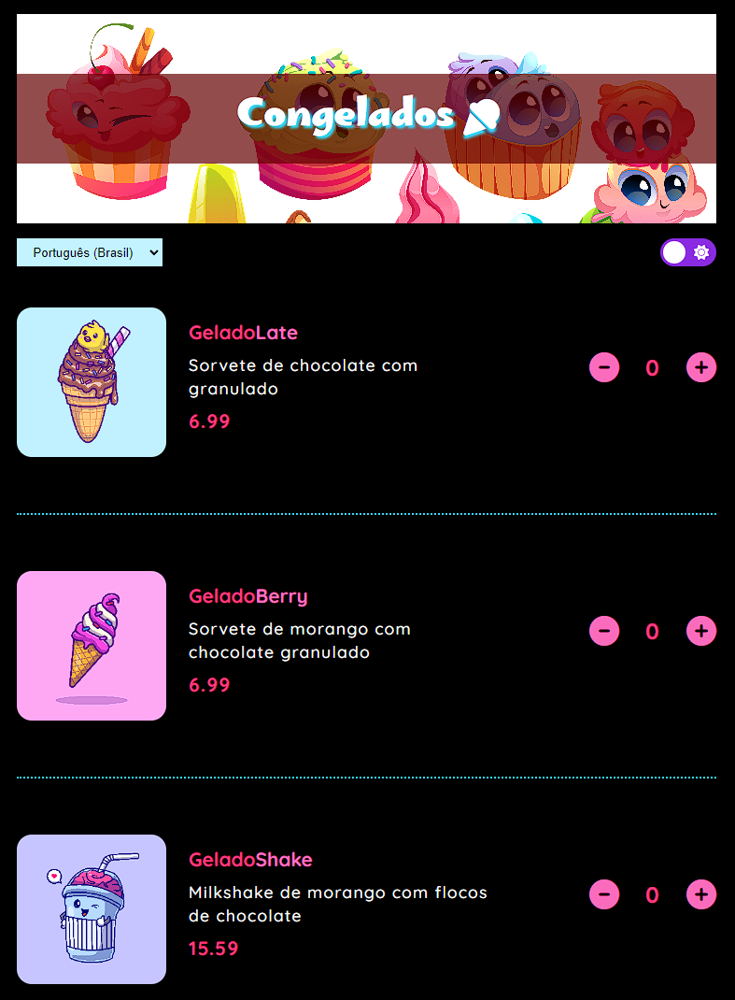
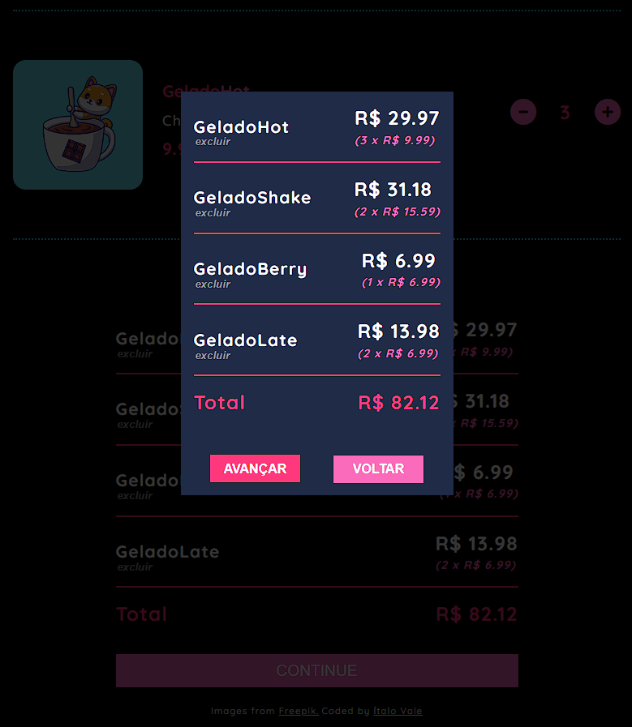
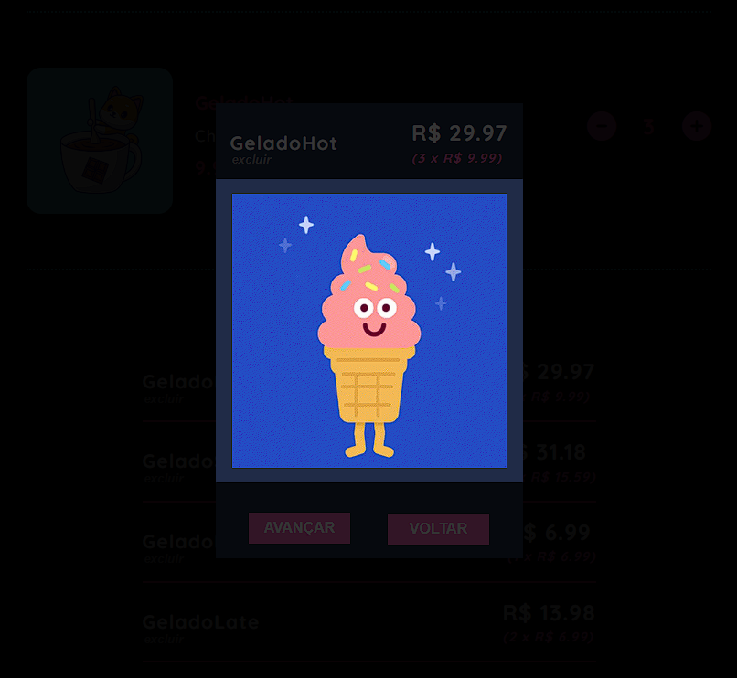
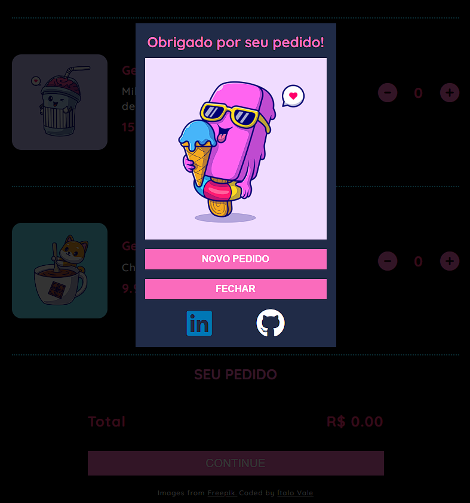

# Sorveteria Congelados

Projeto solo desenvolvido com base nas aulas da plataforma Scrimba com JavaScript, CSS e HTML.
Eu desenvolvi uma aplicação de uma sorveteria em que é possível selecionar a quantidade de cada um dos sabores de sorvete, visualizar um resumo da compra com o valor total do pedido, o usuário poderá excluir um determinado item ou avançar com a compra, além de permitir a mudança de idioma entre inglês e português e alterar o tema entre claro e escuro.   

### Objetivo

A proposta é o desenvolvimento de uma aplicação utilizando conceitos aprendidos durante o módulo 5 da Plataforma Scrimba (Essential JavaScript concepts).   

### Principais conceitos aplicados

- __Atributos data-* (Data attributes)__: Utilizado para armazenar informações extras em elementos HTML. Eu adicionei data attributes com um ID específico (o ID é gerado aleatoriamente com o uuidv4 - Identificador Único Universal) nos "botões" de adicionar e subtrair itens. E apliquei um addEventListener no document para capturar cliques nos botões, identificar qual o atributo deste respectivo botão e acionar uma function para somar/subtrair os valores e alterar o TextContent da quantidade de itens.
- __ForEach__: Método para percorrer os arrays com os sabores de sorvete.  
- __Filter__: Método para filtrar somente um sorvete do array de cada vez.  
- __Elemento Dialog__: Caixa de diálogo interativa para confirmar e avançar com a compra.   

### Criação

- Mobile first
- HTML semântico
- Variáveis CSS
- Flexbox
- Dialog
- JavaScript 
  

### Link
- Site: [https://congelados-sorveteria.netlify.app/](https://congelados-sorveteria.netlify.app/)
  

### Screenshots

## Autor

- GitHub - [ValeItalo](https://github.com/ValeItalo)
- LinkedIn - [Ítalo Vale](https://www.linkedin.com/in/ítalo-vale-878b7b228)
